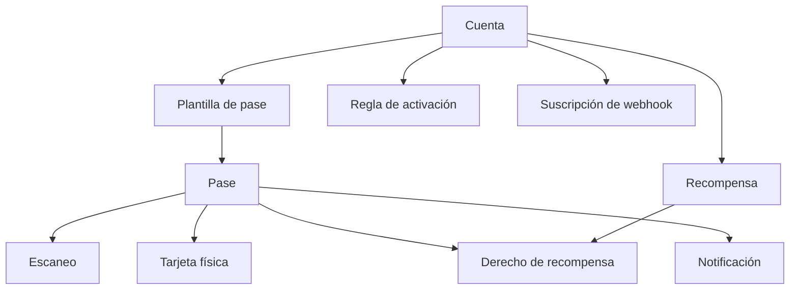

# Conceptos

Antes de integrarte conviene tener claro el vocabulario de Alara y cómo se conectan los objetos entre sí.

---

## Modelo general

---

## Cuenta

Tu organización dentro de Alara. Es el contenedor de todo lo demás: plantillas, pases, escaneos, recompensas y reglas.

Tu API key identifica exactamente una cuenta y todas las consultas se filtran automáticamente a ella.

<Note>
  En esta documentación, **cuenta** se refiere a tu negocio. A la persona que trae el pase en su teléfono le llamamos **portador del pase**, nunca "cliente", para evitar confusiones.
</Note>

---

## Plantilla de pase

El diseño de un pase de wallet: información básica, qué tipo de programa representa y —lo más importante para tu integración— **qué campos acepta**.

Cada plantilla define una lista blanca de campos visibles. Un pase solo puede escribir en `visible` las llaves declaradas en su plantilla; cualquier otra llave se rechaza con `400 INVALID_INPUT`.

Consulta los campos disponibles con [`GET /v1/pass-templates/accepted-fields`](/api/plantillas-de-pases).

<Warning>
  En plantillas de lealtad, el campo que muestra los puntos o sellos está **bloqueado** (`locked: true`). Ese contador lo administra Alara: se actualiza únicamente a través de [`POST /v1/passes/{id}/loyalty`](/api/pases#ajustar-saldo-de-lealtad), nunca escribiéndolo a mano en `visible`.
</Warning>

---

## Pase

Un pase digital emitido a una persona. Es el objeto central de la API.

Un pase tiene dos bolsas de datos:

- **`visible`** — pares llave/valor que se muestran en el pase. Las llaves deben existir en la plantilla.
- **`hidden`** — datos libres que tú asocias al pase para tu propio uso. Nunca se muestran al portador y no están limitados por la plantilla.

### Ciclo de vida

| `status` | Significado |
| --- | --- |
| `creating` | El pase se está generando. Es un estado transitorio. |
| `creation_failed` | La generación falló. El campo `creation_error` explica por qué. |
| `issued` | El pase ya existe y se puede descargar, pero aún no se instala. |
| `active` | El pase está instalado en el wallet del portador. |
| `removed` | El portador desinstaló el pase de su wallet. |
| `deactivated` | Tú desactivaste el pase (por ejemplo, con `DELETE`). |

### Identificadores

Tú eliges el identificador del pase al crearlo (`pass_id`). Ese es el mismo valor que usarás en el resto de la API y el que recibirás en las respuestas y los webhooks.

---

## Escaneo

El registro de una validación del pase: una lectura en la entrada de un evento, en el punto de venta o en un lector NFC.

Un escaneo guarda qué pase se leyó (`pass_id`), en qué lector (`scanner_id`), cuándo, con qué metadatos y —lo más importante— **cuál fue el veredicto**:

| `status` | Significado |
| --- | --- |
| `succeeded` | El escaneo se aceptó. |
| `failed` | El escaneo se rechazó. El campo `reason` indica el motivo, por ejemplo `DOUBLE_SCAN` o `PASS_SUSPENDED`. |
| `processing` | El escaneo se está evaluando. |

<Warning>
  Un escaneo **rechazado** también responde `200 OK`. El veredicto va en el campo `status` del cuerpo, no en el código HTTP. Siempre revisa `status` antes de dar acceso o entregar un beneficio.
</Warning>

Los escaneos son el flujo de eventos que alimenta la lealtad y las [reglas de activación](/api/reglas-de-activacion).

---

## Lector

El dispositivo o punto donde se escanea un pase. En la API lo identificas con la cadena que envías en `reader_id` al registrar un escaneo, y lo recibes de vuelta como `scanner_id`.

Los lectores se administran desde el Dashboard; la API pública solo los referencia por su identificador.

---

## Tarjeta física

Una tarjeta NFC o RFID vinculada a un pase digital. Al leerse la tarjeta, el sistema resuelve el pase correspondiente, de modo que una tarjeta de plástico y un pase en el teléfono representan al mismo portador.

Consulta [Tarjetas físicas](/api/tarjetas-fisicas).

---

## Saldo de lealtad

Un pase puede llevar un contador. El campo `loyalty_type` indica de qué tipo es:

| `loyalty_type` | Descripción |
| --- | --- |
| `none` | El pase no tiene programa de lealtad. |
| `balance` | Acumula puntos o saldo. |
| `stamps` | Acumula sellos (tarjeta de sellos). |

El valor actual vive en `balance` y solo se modifica con [`POST /v1/passes/{id}/loyalty`](/api/pases#ajustar-saldo-de-lealtad), que envía un delta (positivo o negativo). Así el contador visible del wallet siempre queda sincronizado.

---

## Recompensa y derecho de recompensa

Alara separa el **catálogo** de las **asignaciones individuales**:

- **Recompensa** (*reward*) — la definición del beneficio en tu catálogo, identificada por un `slug` estable (`cafe_gratis`). Define el tipo, cuántas veces puede canjearse, cuántas veces puede asignarse y cuándo expira. Editar una recompensa publica una **versión** nueva; las asignaciones existentes conservan la versión con la que se crearon.
- **Derecho de recompensa** (*entitlement*) — la instancia asignada a un pase concreto. Tiene su propio vencimiento, sus canjes restantes y su estado: `available`, `redeemed` o `expired`.

El canje es irreversible y lo realiza el negocio, no el portador.

Consulta [Recompensas](/api/recompensas).

---

## Notificación

Un mensaje push enviado a los pases instalados. Puedes enviarlo de inmediato a un pase concreto, o programarlo hacia el futuro dirigido a una lista de pases, a una audiencia guardada o a todos tus pases.

Consulta [Notificaciones](/api/notificaciones).

---

## Regla de activación

Automatización del lado de Alara: una **condición** más una lista de **acciones**.

Las condiciones se evalúan sobre escaneos, campos de fecha o el contador de sellos; las acciones envían un push, escriben un campo, ajustan la lealtad o asignan una recompensa.

Consulta [Reglas de activación](/api/reglas-de-activacion).

---

## Suscripción de webhook

Un endpoint HTTPS tuyo, registrado en Alara, que recibe eventos firmados cuando algo cambia: se creó un pase, se actualizó un saldo, se registró un escaneo.

Consulta [Webhooks](/api/webhooks/introduccion).

---

## Funciones que viven solo en el Dashboard

Estas funciones existen en Alara pero **no** están expuestas en la API pública `/v1`. Se administran desde el Dashboard:

- **Audiencias** — segmentos guardados de pases. Puedes *usar* una audiencia como destinatario de una notificación por API (con su `audience_id`), pero crearlas y editarlas es exclusivo del Dashboard.
- **Cargas masivas** — importación de pases por CSV o Excel.
- **Lectores** — alta y configuración de dispositivos de escaneo.
- **Equipo y usuarios** — administración de accesos al Dashboard.
