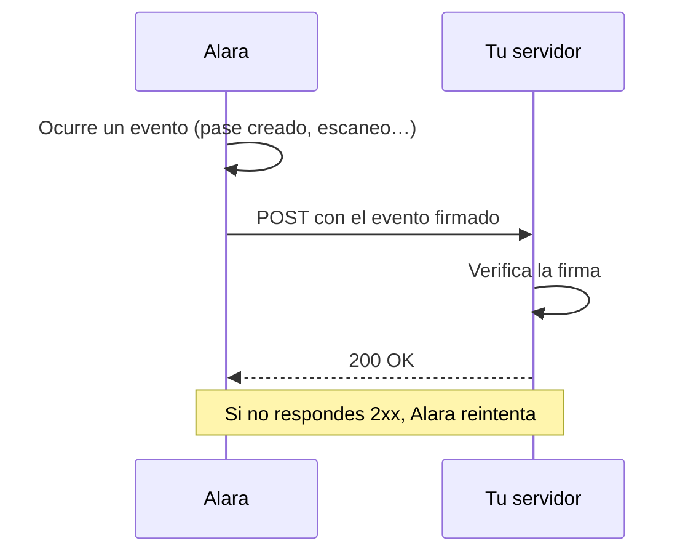

# Webhooks

En lugar de consultar la API cada cierto tiempo para saber si algo cambió, registra un endpoint HTTPS y Alara te avisa: cuando se emite un pase, cuando cambia un saldo, cuando se registra un escaneo.

<Note>
  Esta función debe estar habilitada en tu cuenta. Si al crear una suscripción recibes `403 FEATURE_DISABLED`, escríbenos a [dev@alaramx.com](mailto:dev@alaramx.com).
</Note>

---

## Cómo funciona



<Steps>
  <Step title="Registras tu endpoint">
    Creas una suscripción indicando tu URL HTTPS y qué eventos quieres recibir. Alara te devuelve un **secreto de firma**, una sola vez.
  </Step>

  <Step title="Alara te envía los eventos">
    Cada evento llega como un `POST` con cuerpo JSON y encabezados de firma.
  </Step>

  <Step title="Verificas la firma">
    Compruebas que el mensaje viene realmente de Alara antes de procesarlo.
  </Step>

  <Step title="Respondes rápido">
    Devuelves `2xx` de inmediato y procesas el evento en segundo plano.
  </Step>
</Steps>

---

## Guías

<CardGroup cols={2}>
  <Card title="Suscripciones" icon="plug" href="/api/webhooks/suscripciones">
    Registra, edita y elimina tus endpoints.
  </Card>

  <Card title="Eventos" icon="list" href="/api/webhooks/eventos">
    Catálogo completo con ejemplos de cada carga útil.
  </Card>

  <Card title="Verificar firmas" icon="shield-check" href="/api/webhooks/verificar-firmas">
    Valida que el evento viene de Alara.
  </Card>

  <Card title="Entregas y reintentos" icon="rotate" href="/api/webhooks/entregas">
    Qué pasa si tu servidor falla o está caído.
  </Card>
</CardGroup>

---

## Formato del evento

Todos los eventos comparten la misma envoltura:

```json
{
  "id": "0f9c1a3e-5d02-4b17-9c3b-a1d2e3f40506",
  "type": "pass.created",
  "created_at": "2026-07-24T09:14:22.481Z",
  "data": {
    "...": "depende del tipo de evento"
  }
}
```

<ResponseField name="id" type="string">
  Identificador único del evento. **Se mantiene idéntico en todos los reintentos**: úsalo para descartar duplicados.
</ResponseField>

<ResponseField name="type" type="string">
  Tipo de evento, por ejemplo `pass.created`. Consulta el [catálogo](/api/webhooks/eventos).
</ResponseField>

<ResponseField name="created_at" type="string">
  Momento en que se generó el evento, RFC 3339.
</ResponseField>

<ResponseField name="data" type="object">
  Estado del recurso afectado. Su forma depende del `type`.
</ResponseField>

---

## Requisitos de tu endpoint

<AccordionGroup>
  <Accordion title="Debe ser HTTPS y públicamente accesible">
    Alara rechaza URLs que no sean `https`, así como `localhost`, dominios internos y direcciones IP privadas o de bucle local.

    Para probar en tu máquina, usa un túnel que exponga tu servidor local con una URL pública HTTPS.
  </Accordion>

  <Accordion title="Debe responder 2xx rápido">
    Cualquier código entre `200` y `299` cuenta como éxito. El tiempo límite es de **10 segundos** por intento, contando conexión y respuesta.

    Haz lo mínimo indispensable: valida la firma, encola el evento y responde. No proceses de forma síncrona.
  </Accordion>

  <Accordion title="Debe tolerar duplicados">
    La entrega es **al menos una vez**. Un mismo evento puede llegar más de una vez, por ejemplo si tu respuesta se perdió en la red. Usa el campo `id` como llave de idempotencia.
  </Accordion>

  <Accordion title="No debe asumir un orden">
    Los eventos pueden llegar desordenados, sobre todo cuando hubo reintentos. No supongas que `pass.created` llegará antes que un `pass.updated` del mismo pase.
  </Accordion>
</AccordionGroup>

---

## Datos que se incluyen

Las cargas útiles llevan solo lo necesario para reaccionar al cambio: identificadores, campos visibles, estado y saldo.

<Warning>
  Los eventos **nunca incluyen** los datos ocultos (`hidden`) del pase, el `qr_value` ni el `download_url`. Si necesitas esa información, consulta el pase con [`GET /v1/passes/{id}`](/api/pases#consultar-un-pase) al recibir el evento.
</Warning>

Además, `data` es una **fotografía del estado al momento de la entrega**, no un diff. Si el recurso cambió dos veces muy rápido, ambas entregas pueden mostrar el mismo estado final. Para saber qué cambió, compara con lo que tengas guardado.
